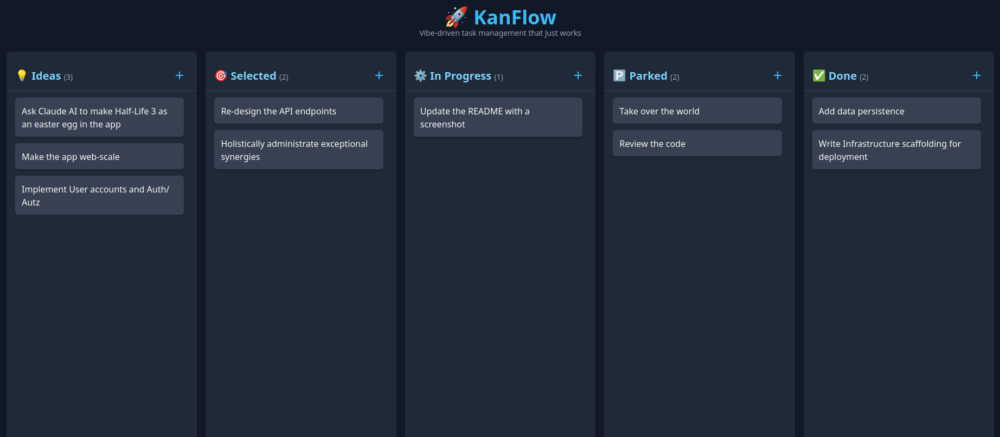

# 🚀 KanFlow

Vibe-driven task management that just works. A simple Kanban board built with React and FastAPI for your homelab. Single-user, made just for YOU.

This project was developed using vibe coding techniques with Claude Code CLI and Claude Web UI. I wanted to see what the fuss was all about with
the new agentic development platform. I must admit that I have been pretty impressed. I tried to not look at the code as much as I could, to
stay true to the spirit of vibe coding. However it means that I really, really can't trust it. But it is designed from the ground up to run
**in an isolated, safe environment**, like in a local network or behind a proxy which handle authentication and only let in people you can trust.

Don't put this thing on the open internet. The AI had no second thought just disabling CORS everywhere, and it implemented a path trasversal
vulnerability that was trivial to exploit. There are certainly more issues lurking around.

You have been warned.



## Tech Stack

### Frontend

- **React 19** with TypeScript
- **Vite** for fast development and building
- **Tailwind CSS** for styling
- **Vitest** and Testing Library for comprehensive testing

### Backend

- **FastAPI** with Python
- **Pydantic** for data validation
- **JSON file storage** with automatic backups

## Getting Started

### Prerequisites

- Node.js (v18 or higher)
- Python 3.8+
- Poetry (for Python dependency management)

### Installation

1. **Clone the repository**

   ```bash
   git clone <repository-url>
   cd kanban
   ```

2. **Install frontend dependencies**

   ```bash
   npm install
   ```

3. **Install backend dependencies**
   ```bash
   cd backend && poetry install
   ```

### Configuration

In "production" (remember, this is a single-user app), the backend can be used to serve the static files from the same endpoint.
Define the `STATIC_DIR` with the content of the dist directory generated by npm.

The database is stored in a json file called `database.json`. By default it is stored in the current directory, but you can override this with `DATA_DIR`.

See the `Dockerfile` for an example of a "production" deployment.

If the application is hosted behind an auth proxy, you can provide a login URL. The user will be redirected there if the server respond
to a GET api call with the HTTP status 401. Use the environment variable `VITE_LOGIN_URL` to set it. We will assume that a manual user page
refresh would also call the GET API and trigger the redirect.

#### Running the Application for development

1. **Start the backend server**

We will need to explicitely disable CORS during development to be able to debug backend and frontend separately:

```bash
cd backend
DEV_NO_CORS=1 poetry run uvicorn app:app --reload
```

The API will be available at `http://localhost:8000`

2. **Start the frontend development server**

```bash
VITE_API_BASE_URL=http://localhost:8000 npm run dev
```

The application will be available at `http://localhost:5173`

## Available Scripts

```bash
make test # Run all the available tests
make fmt  # Format the code
```

## Data Persistence

Tasks are automatically saved to a `database.json` file with:

- Periodic backups every minute
- Automatic restoration on server restart
- Default sample data for new installations

## Testing

The project includes comprehensive test coverage:

- **Frontend**: Component tests, hook tests, and integration tests using Vitest and Testing Library
- **Backend**: API endpoint tests using pytest

Run all tests:

```bash
make test
```
